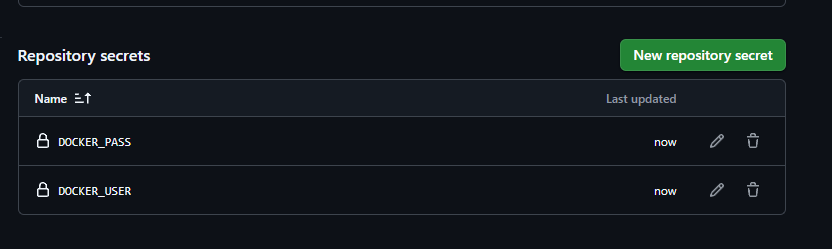
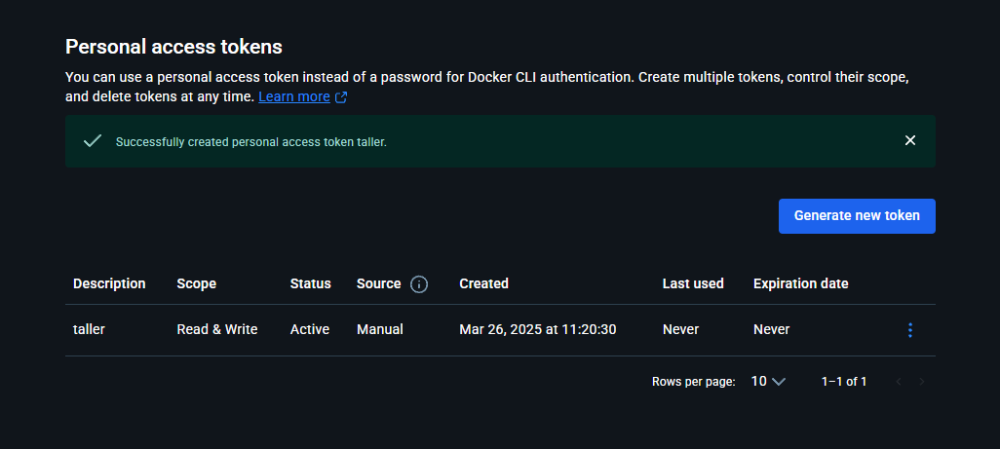

# Creacion de Dockerfile

Dado que el comando de ejecución en desarrollo es ```npm run dev```

```
# Usa una imagen base ligera de Node.js 18
FROM node:18-alpine  

# Establece el directorio de trabajo en el contenedor
WORKDIR /app  

# Copia y instala solo las dependencias antes de agregar el código
COPY package.json package-lock.json ./  
RUN npm install --frozen-lockfile  

# Copia el resto de los archivos de la aplicación
COPY . .  

# Expone el puerto que usará la aplicación
EXPOSE 3000  

# Inicia la aplicación en modo desarrollo
CMD ["npm", "run", "dev"]  
```

Genero un access token con permisos de lectura y escritura de mi cuenta de docker y los creo como secrets para poder usarlos en el pipeline de manera segura

DOCKER_PASS: dckr_pat_o590cUCl7iQKOBDXBVA6vMsoj1g
DOCKER_USER: elkofix





Ahora creo el workflow para construir la imagen, loguearse y pushear la imagen en ```.github/workflows/```, con el nombre ```push.yml``

```
name: Docker Build & Push

on:
  push:
    branches:
      - main # Este workflow se ejecuta cada vez que se realiza un push en la rama "main".

jobs:
  build-and-push:
    runs-on: ubuntu-latest # El job se ejecuta en un entorno con Ubuntu como sistema operativo.

    steps:
      - name: Checkout Repository
        uses: actions/checkout@v4
        # Obtiene el codigo en el agente

      - name: Log in to Docker Hub
        uses: docker/login-action@v2
        with:
          username: ${{ secrets.DOCKER_USER }}
          password: ${{ secrets.DOCKER_PASS }}
        # Inicia sesión en Docker Hub utilizando credenciales almacenadas en los secretos del repositorio.

      - name: Build Docker Image
        run: |
          docker build -t ${{ secrets.DOCKER_USER }}/mi-aplicacion:latest .
        # Construye una imagen de Docker usando el Dockerfile del repositorio

      - name: Push Docker Image
        run: |
          docker push ${{ secrets.DOCKER_USER }}/mi-aplicacion:latest
        # Sube la imagen construida al registro de Docker Hub.
```


# Getting Started with Create React App

This project was bootstrapped with [Create React App](https://github.com/facebook/create-react-app).
hi

## Available Scripts

In the project directory, you can run:

### `npm start`

Runs the app in the development mode.\
Open [http://localhost:3000](http://localhost:3000) to view it in your browser.

The page will reload when you make changes.\
You may also see any lint errors in the console.

### `npm test`

Launches the test runner in the interactive watch mode.\
See the section about [running tests](https://facebook.github.io/create-react-app/docs/running-tests) for more information.

### `npm run build`

Builds the app for production to the `build` folder.\
It correctly bundles React in production mode and optimizes the build for the best performance.

The build is minified and the filenames include the hashes.\
Your app is ready to be deployed!

See the section about [deployment](https://facebook.github.io/create-react-app/docs/deployment) for more information.

### `npm run eject`

**Note: this is a one-way operation. Once you `eject`, you can't go back!**

If you aren't satisfied with the build tool and configuration choices, you can `eject` at any time. This command will remove the single build dependency from your project.

Instead, it will copy all the configuration files and the transitive dependencies (webpack, Babel, ESLint, etc) right into your project so you have full control over them. All of the commands except `eject` will still work, but they will point to the copied scripts so you can tweak them. At this point you're on your own.

You don't have to ever use `eject`. The curated feature set is suitable for small and middle deployments, and you shouldn't feel obligated to use this feature. However we understand that this tool wouldn't be useful if you couldn't customize it when you are ready for it.

## Learn More

You can learn more in the [Create React App documentation](https://facebook.github.io/create-react-app/docs/getting-started).

To learn React, check out the [React documentation](https://reactjs.org/).

### Code Splitting

This section has moved here: [https://facebook.github.io/create-react-app/docs/code-splitting](https://facebook.github.io/create-react-app/docs/code-splitting)

### Analyzing the Bundle Size

This section has moved here: [https://facebook.github.io/create-react-app/docs/analyzing-the-bundle-size](https://facebook.github.io/create-react-app/docs/analyzing-the-bundle-size)

### Making a Progressive Web App

This section has moved here: [https://facebook.github.io/create-react-app/docs/making-a-progressive-web-app](https://facebook.github.io/create-react-app/docs/making-a-progressive-web-app)

### Advanced Configuration

This section has moved here: [https://facebook.github.io/create-react-app/docs/advanced-configuration](https://facebook.github.io/create-react-app/docs/advanced-configuration)

### Deployment

This section has moved here: [https://facebook.github.io/create-react-app/docs/deployment](https://facebook.github.io/create-react-app/docs/deployment)

### `npm run build` fails to minify

This section has moved here: [https://facebook.github.io/create-react-app/docs/troubleshooting#npm-run-build-fails-to-minify](https://facebook.github.io/create-react-app/docs/troubleshooting#npm-run-build-fails-to-minify)
